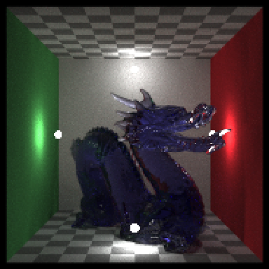
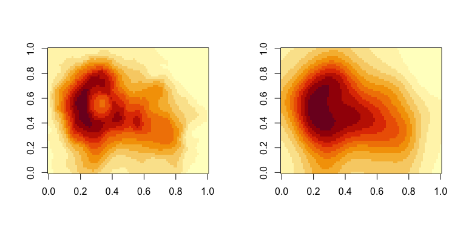
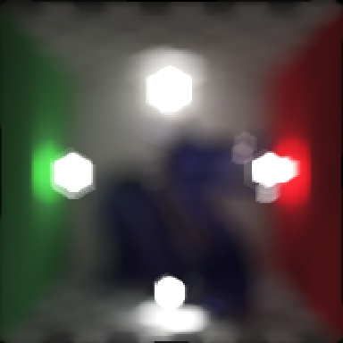
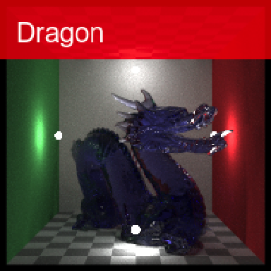
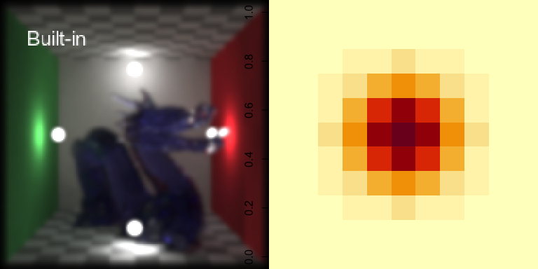
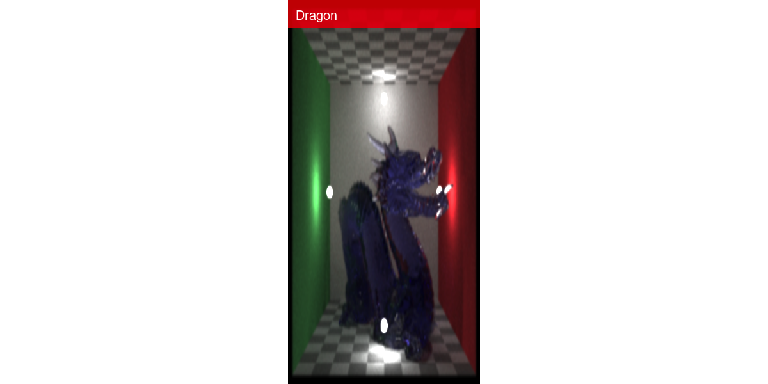
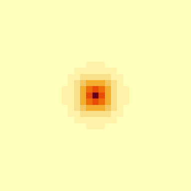
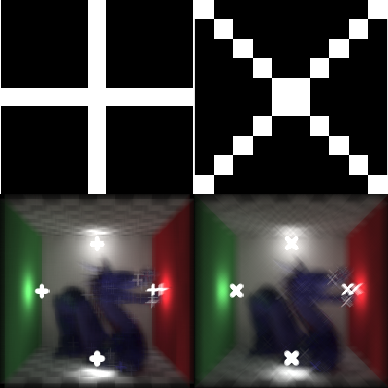

# rayimage

</img>

## Overview

**rayimage** is an open source R package for image manipulation and
simulated camera effects. **rayfocus** uses convolution-based techniques
to generate simulated camera bokeh, depth of field, and other camera
effects, using an image and an optional depth map. It includes functions
to perform 2D convolutions, add image overlays, generate camera vignette
effects, and add titles to images.

## Installation

``` r
# To install the latest version from Github:
# install.packages("remotes")
remotes::install_github("tylermorganwall/rayimage")
```

## Functions

`render_bokeh` takes two images as an input: an in-focus image, and a
depth map for that image. These can either be in-memory representations
of the image, or file paths to the images. The user can also specify
various camera settings, including:

  - Focal point
  - Focal length
  - F-stop
  - Aperture shape (including custom aperture shapes passed by the user)
  - Aperture rotation
  - Bokeh intensity
  - Bokeh intensity limit

The output is either plotted to the current device, or save to a file
(if a filename is passed to the function).

`render_convolution` performs a convolution with a user-supplied kernel
(either custom, or using one of the built-in functions to generate a
kernel: `generate_2d_gaussian`, `generate_2d_exponential`, and
`generate_2d_disk`).

`add_title` adds titles to images, with an optional title bar. User can
specify opacity, color, and font properties. `add_vignette` adds a
camera vignette effect. `add_overlay` adds overlays to images.

`plot_image` plots an RGB array to the current device.

## Usage

The package comes with a sample image and depth map derived from
Stanford “Chinese Dragon” 3D model. The image is included in rayimage as
`dragon` and the depthmap is `dragondepth`.

``` r
library(rayimage)

par(mfrow = c(1,2))
plot_image(dragon)
image(dragondepth, col = hcl.colors(256, "YlOrRd", rev = TRUE), asp=1)
```

<!-- -->

Preview the focal plane.

``` r
par(mfrow = c(1,2))
render_bokeh(dragon,dragondepth,focus=930,preview_focus = TRUE)
```

    ## [1] "Focal range: 847.644-1410.17"

``` r
render_bokeh(dragon,dragondepth,focus=930,focallength=250)
```

<!-- -->

``` r
render_bokeh(dragon,dragondepth,focus=1300,preview_focus = TRUE)
```

    ## [1] "Focal range: 847.644-1410.17"

``` r
render_bokeh(dragon,dragondepth,focus=1300,focallength=250)
```

<!-- -->

We can also adjust the focal point, shape of the aperture, f-stop, focal
length, as well as the bokeh intensity.

``` r
par(mfrow = c(1,2))
render_bokeh(dragon,dragondepth,focus=1100,focallength = 400,
             bokehshape = "hex", bokehintensity = 1)
render_bokeh(dragon,dragondepth,focus=900,focallength = 400,
             bokehshape = "hex", bokehintensity = 1)
```

<!-- -->

``` r
render_bokeh(dragon,dragondepth,focus=900,focallength = 400,
             fstop = 16, bokehshape = "hex")
render_bokeh(dragon,dragondepth,focus=900,focallength = 300,
             bokehshape = "hex", bokehintensity = 5)
```

<!-- -->

We can add a camera vignette effect, titles, and overlays (not shown
here):

``` r
par(mfrow = c(1,2))

dragon %>%
  add_title("Dragon", title_size = 20, title_bar_color = "red", 
            title_bar_alpha=0.8, title_color="white", title_offset = c(12,12)) %>%
  plot_image()

dragon %>%
  add_vignette(vignette=0.8) %>%
  plot_image()
```

<!-- -->

We can also use the `render_convolution()` directly to perform a
convolution with a user-defined (or built-in) kernel.

``` r
par(mfrow = c(1,2))
#Default gaussian kernel
render_convolution(dragon, kernel = "gaussian", preview = FALSE) %>%
  add_title("Built-in", title_size=15, title_color="white", preview = TRUE)
image(generate_2d_gaussian(1,1,11,3), asp=1)
```

<!-- -->

``` r
#Custom gaussian kernel
render_convolution(dragon, kernel = generate_2d_gaussian(10,1,31,21))
image(generate_2d_gaussian(10,1,31,21), asp=1)
```

<!-- -->

``` r
#Custom exponential kernel
render_convolution(dragon, kernel = generate_2d_exponential(3,31,21))
image(generate_2d_exponential(3,31,21), asp=1)
```

<!-- -->

``` r
#Custom disk kernel
render_convolution(dragon, kernel = generate_2d_disk(31))
image(generate_2d_disk(31), asp=1)
```

<!-- -->

And here we use a user-defined kernel, in the shape of a cross.

``` r
par(mfrow = c(2,2))
custom1 = matrix(0, nrow=11,ncol=11)
custom1[6,] = 1
custom1[,6] = 1
custom2 = diag(10) + (diag(10)[,10:1])
plot_image(custom1)
plot_image(custom2)

#Horizontal cross
render_convolution(dragon, kernel = custom1)
#Diagonal cross
render_convolution(dragon, kernel = custom2)
```

<!-- -->
