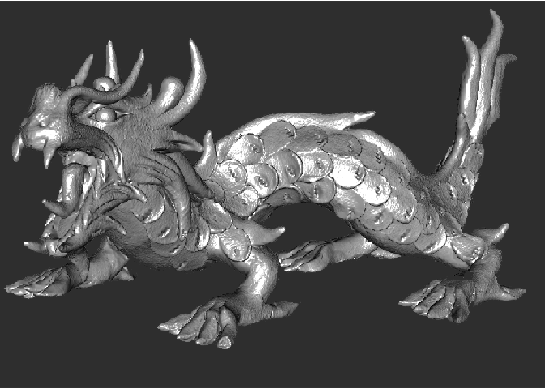
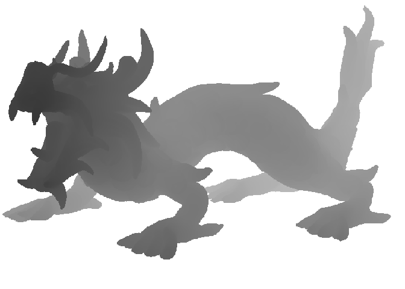
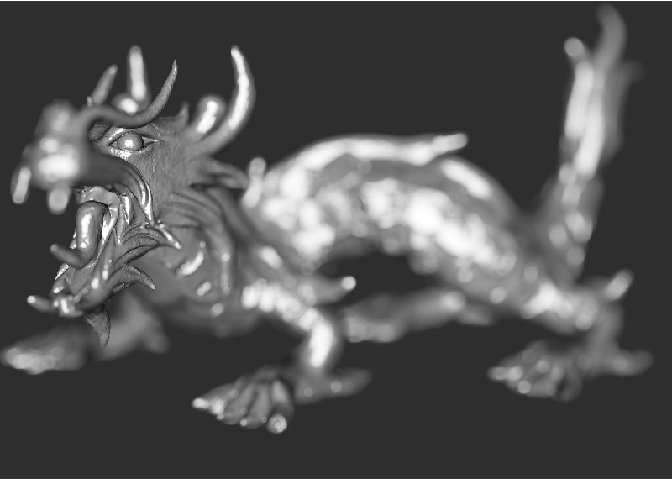
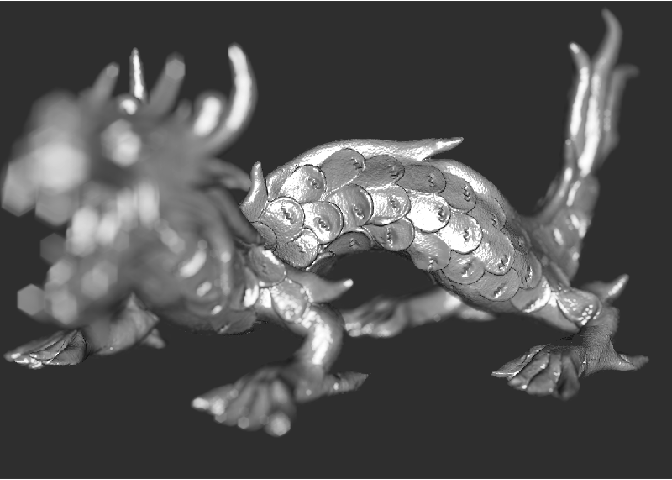

rayfocus
========

</img>

Overview
--------

**rayfocus** is an open source package for rendering a depth of field for images. This is done by using a user-supplied depth map to variably blur the image based on distance, and supports a user-defined focal length, focal distance, and aperture shape.

Installation
------------

``` r
# To install the latest version from Github:
# install.packages("devtools")
devtools::install_github("tylermorganwall/rayfocus")
```

Functions
---------

rayfocus currently has only one function:

`render_bokeh` takes two images as an input: an in-focus image, and a depth map for that image. These can either be in-memory representations of the image, or filepaths to the images. The user can also specify various camera settings, including:

-   Focal point
-   Focal length
-   F-stop
-   Aperture shape (including custom aperture shapes passed by the user)
-   Aperture rotation
-   Bokeh intensity

The output is either plotted to the current device, or save to a file (if a filename is passed to the function).

Usage
-----

The package comes with a sample image and depth map derived from Stanford "dragon" 3D model. The image is in memory as `dragon` and the depthmap is `dragondepth`.

``` r
#load rayshader package for raster plotting
library(rayshader)
library(rayfocus)

plot_map(dragon)
```



``` r
plot_map(t(dragondepth[nrow(dragondepth):1,])) #re-orient 2D matrix to display correctly
```



``` r
render_bokeh(dragon,dragondepth,focus=0.4)
```




We can also adjust the shape of the aperture, as well as the bokeh intensity.

``` r
render_bokeh(dragon,dragondepth,focus=0.6,focallength = 100,
             fstop = 4, bokehshape = "hex", bokehintensity = 5)
```


